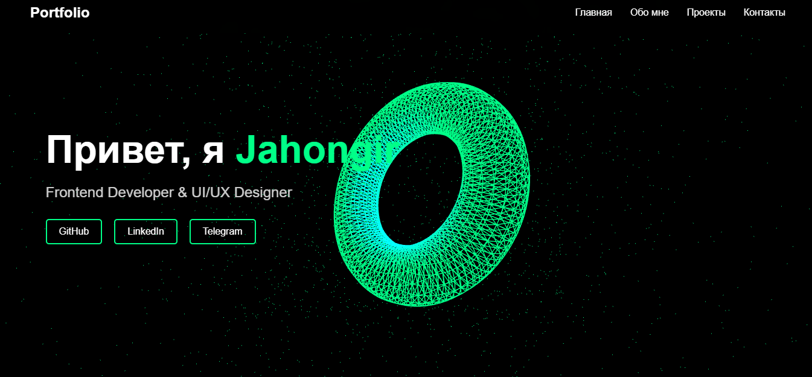

# MKSDVVC Portfolio

Современное 3D-портфолио с интерактивным дизайном. Разработано на HTML5, CSS3 и JavaScript с использованием Three.js для создания впечатляющих 3D-эффектов. Включает анимированные переходы, адаптивный дизайн и удобную навигацию. Демонстрирует проекты в стильных карточках с модальными окнами.

## ✨ Особенности
- Интерактивный 3D-фон
- Адаптивный дизайн
- Анимированные переходы
- Модальные окна для проектов
- Форма обратной связи

## 🛠 Технологии
- HTML5 & CSS3
- JavaScript (ES6+)
- Three.js
- GSAP

## 👨‍💻 Автор
Jahongir Maksudov ([@mksdvvc](https://t.me/mksdvvc))

## 📝 Лицензия
© 2024 Jahongir Maksudov. Все права защищены. 